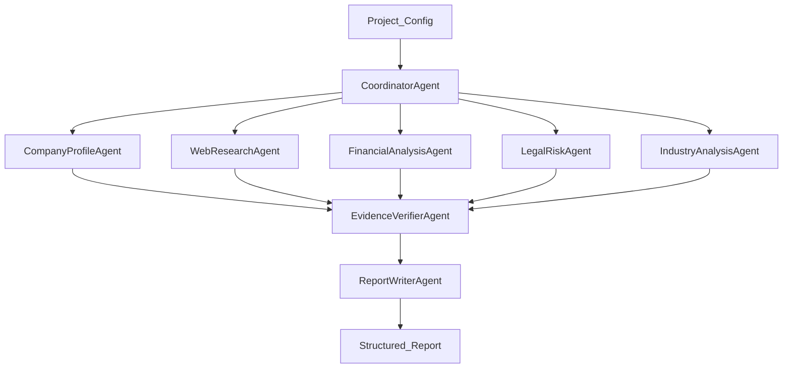

# Agent Flow

The due diligence workflow is intentionally split into generic agent configuration and company-specific run input.

## Agents

| Agent | Purpose | Main Output |
| --- | --- | --- |
| `CoordinatorAgent` | Build the run plan and assign tasks. | Task list and execution plan. |
| `CompanyProfileAgent` | Identify the company profile, leadership, website, products, and ownership hints. | Company profile findings. |
| `WebResearchAgent` | Gather public web, news, announcement, and market references. | Source-backed research findings. |
| `FinancialAnalysisAgent` | Analyze funding, financial signals, operating scale, and business model. | Financial observations and risks. |
| `LegalRiskAgent` | Identify litigation, penalties, sanctions, IP, and compliance risks. | Legal and compliance risk findings. |
| `IndustryAnalysisAgent` | Compare the company with competitors and market dynamics. | Industry position and competitive analysis. |
| `EvidenceVerifierAgent` | Validate evidence coverage, confidence, and conflicts. | Evidence quality summary. |
| `ReportWriterAgent` | Produce the final structured report. | Due diligence report sections. |

## Agent Rules

Every agent must follow these rules:

- Do not invent facts.
- Mark uncertain findings with low confidence.
- Attach evidence IDs to material conclusions.
- Keep conflicting information visible instead of hiding it.
- Return structured JSON that conforms to the shared schema.

## Workflow

## Tool Groups

| Tool Group | Purpose |
| --- | --- |
| `search` | Search public web and configured trusted sources. |
| `web_fetch` | Fetch and normalize web page content. |
| `file_reader` | Extract content from uploaded files. |
| `vector_retrieval` | Retrieve relevant chunks from indexed project resources. |
| `evidence_store` | Create and update evidence records. |
| `report_store` | Persist report sections and versions. |

The MVP implements deterministic versions of these tools. Production integrations should keep the same tool names and return compatible schemas.
