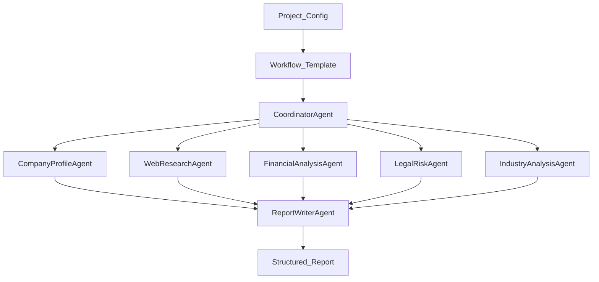

# Agent Flow

The due diligence workflow is intentionally split into generic agent configuration and company-specific run input.

## Agents

| Agent | Purpose | Main Output |
| --- | --- | --- |
| `CoordinatorAgent` | Build the run plan and assign tasks. | Task list and execution plan. |
| `CompanyProfileAgent` | Identify the company profile, leadership, website, products, and ownership hints. | Company profile findings. |
| `WebResearchAgent` | Gather public web, news, announcement, and market references. | Source-backed research findings. |
| `FinancialAnalysisAgent` | Analyze funding, financial signals, operating scale, and business model. | Financial observations and risks. |
| `LegalRiskAgent` | Identify litigation, penalties, sanctions, IP, and compliance risks. | Legal and compliance risk findings. |
| `IndustryAnalysisAgent` | Compare the company with competitors and market dynamics. | Industry position and competitive analysis. |
| `ReportWriterAgent` | Produce the final structured report. | Due diligence report sections. |

## Agent Rules

Every agent must follow these rules:

- Do not invent facts.
- Mark uncertain findings with low confidence.
- Ground material conclusions in tool results or prior agent output folders.
- Keep conflicting information visible instead of hiding it.
- Return structured JSON that conforms to the shared schema.

## Workflow

Workflow templates are file-backed under `agent_service/configs/scenario_templates/` and managed through the backend configuration catalog. A company project selects one published template through `scope.workflow_template_id`, so the same agent flow can be reused for many companies while different scenarios can choose different agent sequences.

Current templates:

- `standard_due_diligence`: full company, web, financial, legal, industry, and report flow.
- `legal_compliance_due_diligence`: legal/compliance-focused flow.
- `financial_investment_due_diligence`: finance/investment-focused flow.
- `market_entry_due_diligence`: market and competitor-focused flow.

At run time, the backend sends an immutable **workflow snapshot** to the agent service. The snapshot includes the workflow graph, agent templates, Anthropic-style skill packages, executable tools, resource configs, and AgentScope ReAct parameters used by that run.

The agent service writes a **session JSON** for each `POST /runs` (on by default): `data/dd_store/agent_service/sessions/<project_id>/<run_id>.json` by default. Set `DD_DATA_ROOT` to move writable data with the backend, or override only this root with `DD_SESSION_HISTORY_DIR`. The file includes `company_config`, `workflow_meta`, `agents_ordered`, an **events** timeline, and on completion the full **`result`** (same data as the HTTP response). Set `DD_SESSION_HISTORY_ENABLED=false` to turn this off. Read-only HTTP: `GET /sessions`, `GET /sessions/{project_id}`, `GET /sessions/{project_id}/{run_id}`.

Each agent template can bind:

- `skill_package_ids`: `SKILL.md` packages that inject procedural guidance and bundled resources into the agent context.
- `tool_ids`: optional platform catalog tools from `tools.yaml`; every ReAct agent also gets AgentScope file/code/shell tools by default.
- `resource_ids`: data resources exposed in the AgentScope ReAct system prompt.
- `react_config`: AgentScope ReAct settings such as `max_iters` and `parallel_tool_calls`.

Skill packages are also synchronized to a fixed project directory at `agent_service/skills/<directory_name>/`. The database remains the configuration catalog, while the project directory keeps the current `SKILL.md` and editable package files visible on disk.

The Agent service builds an AgentScope ReAct runtime for every agent from this snapshot. The runtime creates an AgentScope `Toolkit`, registers the selected tool functions, materializes selected `SKILL.md` packages and package files as AgentScope agent skills, injects bound resources into the ReAct system prompt, and calls the configured real model through an Anthropic Messages-compatible provider.

Default model config:

```json
{
  "baseUrl": "http://127.0.0.1:8081/v1",
  "apiKey": "yuanjun",
  "api": "anthropic-messages",
  "models": [
    {
      "id": "kimi-code",
      "name": "kimi-code(Custom Provider)",
      "reasoning": true,
      "input": ["text", "image"],
      "contextWindow": 128000,
      "maxTokens": 4096
    }
  ]
}
```

When the workflow graph comes from the snapshot rather than YAML defaults alone, coordinator, research agents, and reporter identifiers may differ while the **overall stage order** (plan, research, analysis, report) stays the same.



## Run observability across services

Runs are intentionally **split across HTTP hops** so the platform API does not block for the duration of LLM-heavy work.

1. **Backend** allocates `run_{random}` (`create_pending_agent_run`), returns **`AgentRunRead`** immediately with **`running`** status.
2. **Agent_service** **`POST /runs`** accepts **`run_id`** in the JSON body when the backend allocates it in advance so the **`RunResult.run_id`** matches the pending row before persistence.
3. **Incremental progress**: after each logical step transitions to **`running`** and again after that step completes the workflow calls **`notify_run_progress`**, which **`POST`**s to **`{PLATFORM_CALLBACK_BASE_URL}/internal/agent-runs/{run_id}/progress`** with header **`X-Agent-Callback-Secret`** (**must equal** **`AGENT_CALLBACK_SECRET`** on the backend). Callback failures are logged only—they **do not abort** the diligence run.

The **frontend workbench polls** the run (`GET /runs/{id}`) while status is `running`, so users see steps grow when callbacks are enabled.

## Tool Groups

Every ReAct agent receives AgentScope built-ins: `view_text_file`, `execute_python_code`, and `execute_shell_command`. Prior-agent handoff folders are listed in the run prompt (`previous_agent_output_folders`) with README text inlined (`previous_agent_handoff_readmes`). Add platform-specific catalog tools in `agent_service/configs/tools.yaml` when needed.
