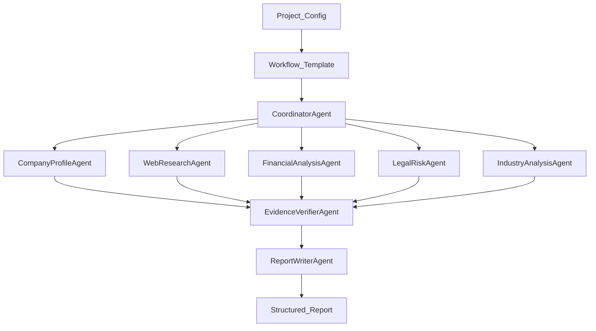

# Agent Flow

The due diligence workflow is intentionally split into generic agent configuration and company-specific run input.

## Agents

| Agent | Purpose | Main Output |
| --- | --- | --- |
| `CoordinatorAgent` | Build the run plan and assign tasks. | Task list and execution plan. |
| `CompanyProfileAgent` | Identify the company profile, leadership, website, products, and ownership hints. | Company profile findings. |
| `WebResearchAgent` | Gather public web, news, announcement, and market references. | Source-backed research findings. |
| `FinancialAnalysisAgent` | Analyze funding, financial signals, operating scale, and business model. | Financial observations and risks. |
| `LegalRiskAgent` | Identify litigation, penalties, sanctions, IP, and compliance risks. | Legal and compliance risk findings. |
| `IndustryAnalysisAgent` | Compare the company with competitors and market dynamics. | Industry position and competitive analysis. |
| `EvidenceVerifierAgent` | Validate evidence coverage, confidence, and conflicts. | Evidence quality summary. |
| `ReportWriterAgent` | Produce the final structured report. | Due diligence report sections. |

## Agent Rules

Every agent must follow these rules:

- Do not invent facts.
- Mark uncertain findings with low confidence.
- Attach evidence IDs to material conclusions.
- Keep conflicting information visible instead of hiding it.
- Return structured JSON that conforms to the shared schema.

## Workflow

Workflow templates are seeded from `agent_service/configs/workflows.yaml` and then managed in the backend configuration catalog. A company project selects one published template through `scope.workflow_template_id`, so the same agent flow can be reused for many companies while different scenarios can choose different agent sequences.

Current templates:

- `standard_due_diligence`: full company, web, financial, legal, industry, verification, and report flow.
- `legal_compliance_due_diligence`: legal/compliance-focused flow.
- `financial_investment_due_diligence`: finance/investment-focused flow.
- `market_entry_due_diligence`: market and competitor-focused flow.

At run time, the backend sends an immutable workflow snapshot to the Agent service. The snapshot includes the workflow graph, agent templates, Anthropic-style skill packages, executable tools, resource configs, and AgentScope ReAct parameters used by that run.

Each agent template can bind:

- `skill_package_ids`: `SKILL.md` packages that inject procedural guidance and bundled resources into the agent context.
- `tool_ids`: executable tools the agent may call, such as search, web fetch, file reader, vector retrieval, evidence store, and report store.
- `resource_ids`: data resources exposed in the AgentScope ReAct system prompt.
- `react_config`: AgentScope ReAct settings such as `max_iters` and `parallel_tool_calls`.

The Agent service builds an AgentScope ReAct runtime for every agent from this snapshot. The runtime creates an AgentScope `Toolkit`, registers the selected tool functions, materializes selected `SKILL.md` packages as AgentScope agent skills, injects bound resources into the ReAct system prompt, and calls the configured real model through an Anthropic Messages-compatible provider.

Default model config:

```json
{
  "baseUrl": "http://127.0.0.1:8081/v1",
  "apiKey": "yuanjun",
  "api": "anthropic-messages",
  "models": [
    {
      "id": "kimi-code",
      "name": "kimi-code(Custom Provider)",
      "reasoning": true,
      "input": ["text", "image"],
      "contextWindow": 128000,
      "maxTokens": 4096
    }
  ]
}
```



## Tool Groups

| Tool Group | Purpose |
| --- | --- |
| `search` | Search public web and configured trusted sources. |
| `web_fetch` | Fetch and normalize web page content. |
| `file_reader` | Extract content from uploaded files. |
| `vector_retrieval` | Retrieve relevant chunks from indexed project resources. |
| `evidence_store` | Create and update evidence records. |
| `report_store` | Persist report sections and versions. |

The MVP implements deterministic versions of these tools. Production integrations should keep the same tool names and return compatible schemas.
