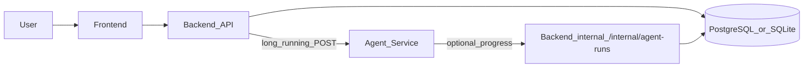
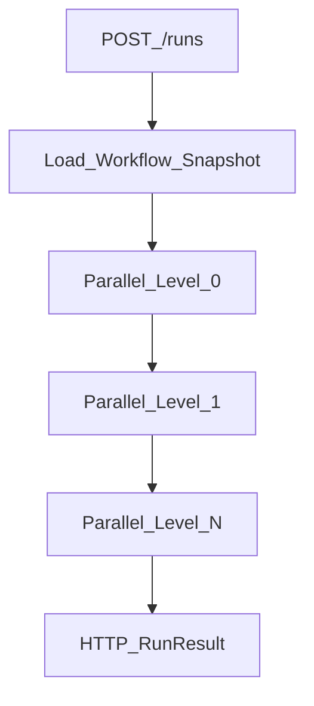

# Harness Platform Architecture

This project is an Agent orchestration workspace with three runtime services:

- `frontend`: React workbench for configuring engagements, monitoring agent runs, and reviewing reports.
- `backend`: FastAPI API for engagements, resources, runs, reports, OAuth-style JWT authentication, and an internal webhook for incremental run progress from the agent process.
- `agent_service`: AgentScope-based orchestration service that runs configurable workflows; tool implementations can be deterministic mocks or pluggable integrations.

Generic workflow configuration stays decoupled from company-specific **engagement configuration** persisted with each `Engagement`.

## Runtime Flow



For local development, typical ports are the frontend dev server on **`5173`**, **`backend` on `8010`**, and **`agent_service` on `8011`** (README + code defaults). Override ports and URLs with environment variables (**see docs/config_schema.md**).

The browser usually talks to the backend through the Vite dev **`/api` proxy** (same origin as the UI) so API calls do not depend on cross-origin CORS during `npm run dev`.

## Run lifecycle (high level)

1. The user starts a run from the backend **POST `/engagements/{engagement_id}/runs`**. The backend inserts an `AgentRun` row with status **`running`** and returns immediately.
2. A background task (thread pool) calls **agent_service POST `/runs`**, passing the immutable **workflow snapshot**, company config, and a **client-allocated `run_id`** so the agent result lines up with the pending row.
3. While the workflow executes, **agent_service** may **POST** step snapshots to **Backend `POST /internal/agent-runs/{run_id}/progress`** (shared secret header). This is optional from a product perspective but enabled by default when `PLATFORM_CALLBACK_BASE_URL` points at the backend so the UI can poll and show incremental steps.
4. When the agent HTTP call completes, the backend **finalizes** the run: status, `raw_result`, steps, and report are written. Finalization clears prior derived rows for that run id and re-attaches the authoritative payload from the agent response to avoid duplicate keys after incremental upserts.
5. The frontend **polls `GET /runs/{id}`** (and refreshes engagement-scoped lists) until the run reaches **`completed`** or **`failed`**.

## Core Concepts

### Generic Agent Configuration

Generic workflow configuration lives under **`catalog/`** (published templates), **`.harness_project/users/{user_id}/workflows/`** (drafts), **`agent_service/configs/tools.yaml`**, **`agent_service/skills/`**, and **`shared/schemas/`**.

It defines:

- Which agents exist.
- Which tools each agent may use.
- Which prompt each agent receives.
- Which output contract each agent must satisfy.
- How the workflow moves from planning to research, analysis, verification, and reporting.

### Company Engagement Configuration

Company-specific configuration is created through the backend and injected into an agent run.

It defines:

- Target company name, aliases, website, jurisdiction, industry, and keywords.
- Target company identity and optional **`workflow_template_id`** on `company_config` for catalog-backed workflows.
- Uploaded files, trusted sources, blocked sources, competitors, and optional notes.

### Source-Backed Outputs

Agent outputs are persisted as per-step handoff folders. Material claims should be grounded in tool results or prior agent handoff folders (`output_dir`, with README inlined in prompts).

## Services

### Backend

The backend owns durable entities:

- `Engagement`
- `Resource`
- `AgentRun`
- `AgentStep`
- `Report`

Configuration catalogs are file-first where practical. **Global agent templates** live under **`catalog/agents/{agent_id}.yaml`** (published), while user saves land in **`.harness_project/users/{user_id}/workflows/_agent_templates/{agent_id}.yaml`** before publish. **Workflow template folders** live under **`catalog/workflow_templates/{workflow_template_id}/`** (published) or **`.harness_project/users/{user_id}/workflows/{workflow_template_id}/`** (user drafts/saves). Each workflow template folder contains **`workflow_template.yaml`** plus an **`agents/`** subdirectory. Run/session/output runtime data is centralized under **`.harness_project/users/{user_id}/workflows/{workflow_template_id}/{engagement_id}/sessions/{session_id}/runs/`** (`{run_id}.json` plus `outputs/`). **`GET/POST/PATCH /workflow-templates`** and **`GET/POST/PATCH /agent-templates`** save into user workflows, while **`POST /workflow-templates/{id}/publish`** and **`POST /agent-templates/{id}/publish`** publish into `catalog/`.

For local development the backend defaults to SQLite at **`HARNESS_DATA_ROOT/platform/harness_platform.db`** (`HARNESS_DATA_ROOT` defaults to repo-root **`.harness_project/data`**; legacy **`dd_platform.db`** in that directory is still opened when **`harness_platform.db`** is absent). Set **`DATABASE_URL`** to use PostgreSQL or another explicit database.

### Agent Service

The agent service exposes HTTP endpoints for runs and executes a configurable workflow via **`WorkflowEngine`**. Published templates resolve to a **DAG execution order** at run time via the backend-built **workflow snapshot** (see [ADR-0005](adr/0005-linear-workflow-graph.md) for historical linear MVP; superseded by DAG levels in `shared/workflow_graph.py`). Within each graph node, a master agent may run followed by optional sub-agents.



ReAct agents use AgentScope built-in file and code execution tools; optional platform catalog tools extend the same `ToolRegistry` interface when listed in `tools.yaml`. Templates may set `workflow.runtime.command_execution: docker` so shell/Python/file reads run in a per-user workflow container while the model stays on the host ([ADR-0011](adr/0011-workflow-docker-execution.md)). Per-step artifacts are written under `sessions/.../runs/outputs/{run_id}_outputs/{run_id}_step_{NNN}_{agent}/` ([run_outputs.md](run_outputs.md)).

### Frontend

The frontend provides a workbench for:

- Creating and editing company engagements.
- Configuring resources and workflow template.
- Starting and monitoring runs (polling plus incremental UI when callbacks are configured).
- Reviewing agent steps and per-step output folders with correct **local timestamps** (**API emits UTC timestamps with `Z`** for runs).
- Reading the generated report (when synthesized from the final agent step; see [ADR-0004](adr/0004-report-from-step-outputs.md)).

## Development Layout

```text
Harness_project/
  backend/
  agent_service/
  frontend/
  shared/
    schemas/
  docs/
```
