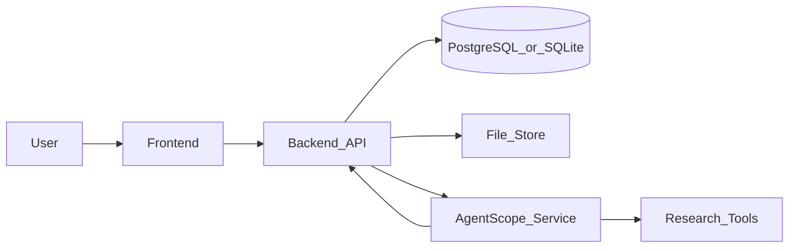
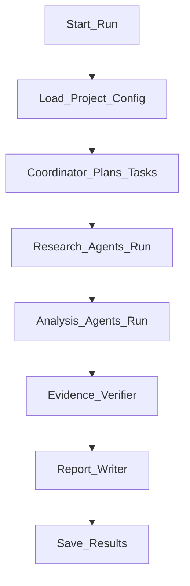

# Due Diligence Platform Architecture

This project is a due diligence workspace with three runtime services:

- `frontend`: React workbench for configuring projects, monitoring agent runs, browsing evidence, and reviewing reports.
- `backend`: FastAPI API for projects, resources, runs, evidence, reports, and persistence.
- `agent_service`: AgentScope-based orchestration service that runs configurable due diligence agents.

The design separates generic due diligence workflow configuration from company-specific project configuration.

## Runtime Flow



## Core Concepts

### Generic Agent Configuration

Generic workflow configuration lives under `agent_service/configs`, `agent_service/prompts`, and `shared/schemas`.

It defines:

- Which agents exist.
- Which tools each agent may use.
- Which prompt each agent receives.
- Which output contract each agent must satisfy.
- How the workflow moves from planning to research, analysis, verification, and reporting.

### Company Project Configuration

Company-specific configuration is created through the backend and injected into an agent run.

It defines:

- Target company name, aliases, website, jurisdiction, industry, and keywords.
- Due diligence scope, time range, focus areas, and report language.
- Uploaded files, trusted sources, blocked sources, competitors, and optional notes.

### Evidence-First Reporting

Agent outputs are structured around evidence. Any conclusion that appears in a report should link back to one or more evidence records with source metadata and confidence.

## Services

### Backend

The backend owns durable entities:

- `Project`
- `CompanyConfig`
- `Resource`
- `AgentRun`
- `AgentStep`
- `Evidence`
- `Report`
- `ReportVersion`

For local development the backend defaults to SQLite. Set `DATABASE_URL` to PostgreSQL for production-like deployments.

### Agent Service

The agent service exposes HTTP endpoints for runs and executes a configurable workflow:



The MVP ships with deterministic tool implementations so the platform can run without external API keys. Real search, document parsing, vector retrieval, and registry integrations can be added behind the same tool interfaces.

### Frontend

The frontend provides a workbench for:

- Creating and editing company due diligence projects.
- Configuring resources and scope.
- Starting and monitoring runs.
- Reviewing agent steps and evidence.
- Reading the generated report.

## Development Layout

```text
DD_project/
  backend/
  agent_service/
  frontend/
  shared/
    schemas/
  docs/
```
