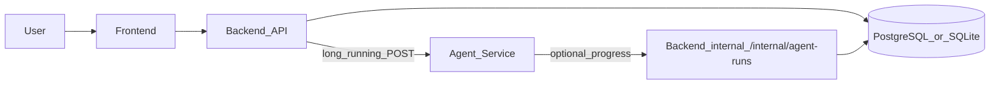
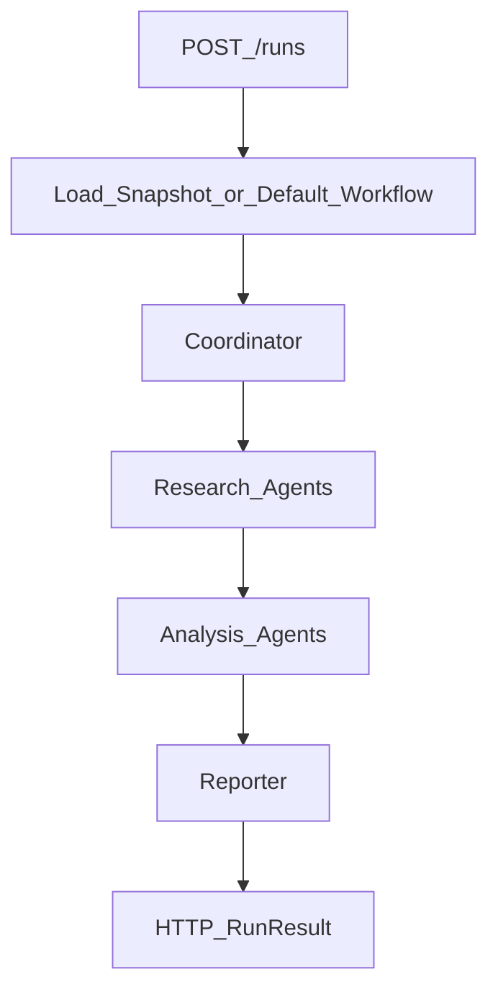

# Due Diligence Platform Architecture

This project is a due diligence workspace with three runtime services:

- `frontend`: React workbench for configuring projects, monitoring agent runs, and reviewing reports.
- `backend`: FastAPI API for projects, resources, runs, reports, OAuth-style JWT authentication, and an internal webhook for incremental run progress from the agent process.
- `agent_service`: AgentScope-based orchestration service that runs configurable workflows; tool implementations can be deterministic mocks or pluggable integrations.

Generic workflow configuration stays decoupled from company-specific **project configuration** persisted with each `Project`.

## Runtime Flow



For local development, typical ports are the frontend dev server on **`5173`**, **`backend` on `8010`**, and **`agent_service` on `8011`** (README + code defaults). Override ports and URLs with environment variables (**see docs/config_schema.md**).

The browser usually talks to the backend through the Vite dev **`/api` proxy** (same origin as the UI) so API calls do not depend on cross-origin CORS during `npm run dev`.

## Run lifecycle (high level)

1. The user starts a run from the backend **POST `/projects/{project_id}/runs`**. The backend inserts an `AgentRun` row with status **`running`** and returns immediately.
2. A background task (thread pool) calls **agent_service POST `/runs`**, passing the immutable **workflow snapshot**, company config, and a **client-allocated `run_id`** so the agent result lines up with the pending row.
3. While the workflow executes, **agent_service** may **POST** step snapshots to **Backend `POST /internal/agent-runs/{run_id}/progress`** (shared secret header). This is optional from a product perspective but enabled by default when `PLATFORM_CALLBACK_BASE_URL` points at the backend so the UI can poll and show incremental steps.
4. When the agent HTTP call completes, the backend **finalizes** the run: status, `raw_result`, steps, and report are written. Finalization clears prior derived rows for that run id and re-attaches the authoritative payload from the agent response to avoid duplicate keys after incremental upserts.
5. The frontend **polls `GET /runs/{id}`** (and refreshes project-scoped lists) until the run reaches **`completed`** or **`failed`**.

## Core Concepts

### Generic Agent Configuration

Generic workflow configuration lives under `agent_service/configs`, `agent_service/prompts`, and `shared/schemas`.

It defines:

- Which agents exist.
- Which tools each agent may use.
- Which prompt each agent receives.
- Which output contract each agent must satisfy.
- How the workflow moves from planning to research, analysis, verification, and reporting.

### Company Project Configuration

Company-specific configuration is created through the backend and injected into an agent run.

It defines:

- Target company name, aliases, website, jurisdiction, industry, and keywords.
- Due diligence scope, time range, focus areas, and report language, including optional **`workflow_template_id`** for catalog-backed workflows.
- Uploaded files, trusted sources, blocked sources, competitors, and optional notes.

### Source-Backed Outputs

Agent outputs are structured as summaries and findings. Material claims should be grounded in tool results or prior agent handoff folders (`output_dir` / `agent_output_reader`).

## Services

### Backend

The backend owns durable entities:

- `Project`
- `Resource`
- `AgentRun`
- `AgentStep`
- `Report`

Configuration catalogs are file-first where practical. **Scenario/workflow templates** live on disk under **`agent_service/configs/scenario_templates/{workflow_id}.yaml`** and contain only workflow metadata plus a graph of `agent_template_id` references. **Agent templates** live separately in **`agent_service/configs/agent_templates.yaml`**. **`GET/POST/PATCH /workflow-templates`** read and write scenario files, while **`GET/POST/PATCH /agent-templates`** read and write the agent catalog. **Skill packages** and **tool configs** are file-backed only: **`agent_service/skills/`** and **`agent_service/configs/tools.yaml`** (the backend API reads and writes those paths directly; there is no SQLite mirror). **ResourceConfig** is loaded from **`catalog/resource_configs/`** plus platform overlays under **`DD_DATA_ROOT/platform/resource_configs/`**. Development seed users are loaded from **`catalog/default_users.yaml`** only when the user table is empty.

For local development the backend defaults to SQLite at **`DD_DATA_ROOT/platform/dd_platform.db`** (`DD_DATA_ROOT` defaults to repo-root **`data/dd_store`**). Set **`DATABASE_URL`** to use PostgreSQL or another explicit database.

### Agent Service

The agent service exposes HTTP endpoints for runs and executes a configurable workflow. Published templates resolve to an ordered agent graph at run time via the backend-built **workflow snapshot** (nodes may differ from the diagram below).



The MVP ships with deterministic tool implementations so the platform can run without external API keys. Real search, document parsing, vector retrieval, and registry integrations can be added behind the same tool interfaces.

### Frontend

The frontend provides a workbench for:

- Creating and editing company due diligence projects.
- Configuring resources and scope.
- Starting and monitoring runs (polling plus incremental UI when callbacks are configured).
- Reviewing agent steps and per-step output folders with correct **local timestamps** (**API emits UTC timestamps with `Z`** for runs).
- Reading the generated report.

## Development Layout

```text
DD_project/
  backend/
  agent_service/
  frontend/
  shared/
    schemas/
  docs/
```
